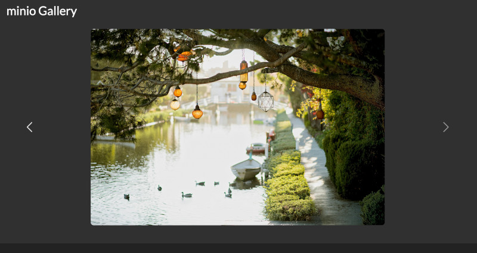

# minio Gallery
A containerised web server that displays images in a minio bucket as a gallery:

## Usage
Add your minio endpoint and access credentials to `docker/compose.yml`. Ensure the user has privileges to listObjects on the bucket you want to view.
To start the web server run: `docker compose --project-directory docker up -d`
By default the server is available at `http://0.0.0.0:80`
In order to view your images construct a url with the minio objects path after prefixing `/images/`. For example: `http://0.0.0.0:80/images/bucket-name/path/to/my/photos/`. This will add all the objects with a mimetype of `images` into img divs in a carousel.

To stop the web server run: `docker compose --project-directory docker down`
